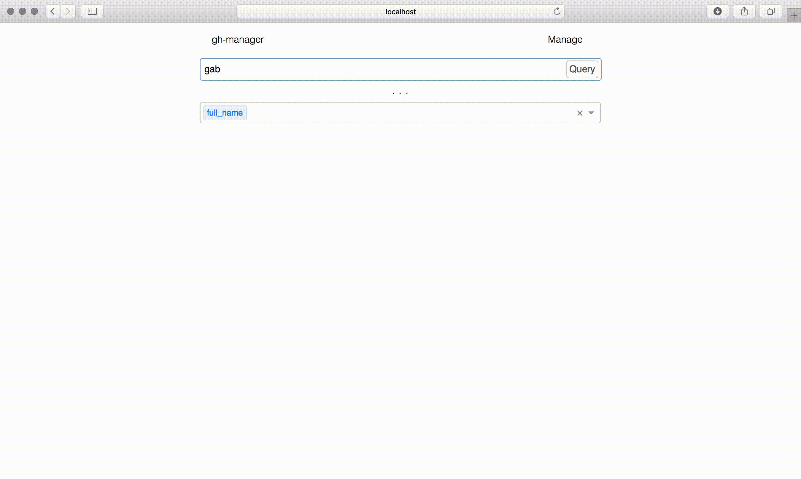

> DEPRECATED: THIS WILL NO LONGER BE UNDER DEVELOPMENT

# gh-manager

> 📋 A github project manager for organizations and personal accounts

[](https://www.npmjs.com/package/gh-manager)
[](https://travis-ci.org/gabrielcsapo/gh-manager)
[](https://lcov-server.gabrielcsapo.com/coverage/github%2Ecom/gabrielcsapo/gh-manager)
[](https://starbuck.gabrielcsapo.com/github/gabrielcsapo/gh-manager)
[](https://starbuck.gabrielcsapo.com/github/gabrielcsapo/gh-manager#info=devDependencies)
[]()
[]()

## Installation

```
npm install gh-manager -g
```

## Usage

```
gh-manager --token ****
```

```
Usage: gh-manager [options]


Options:

  -V, --version        output the version number
  -t, --token <token>  github access token to make requests.
  -h, --help           output usage information
```

## Example



## Screenshots


